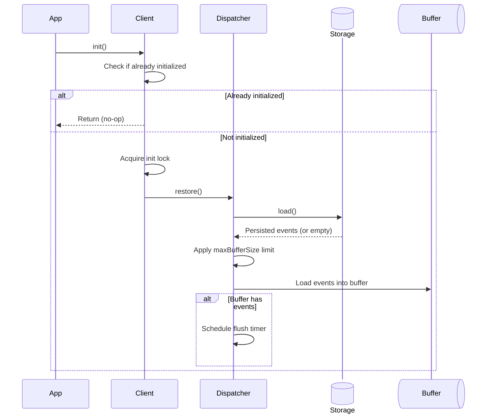
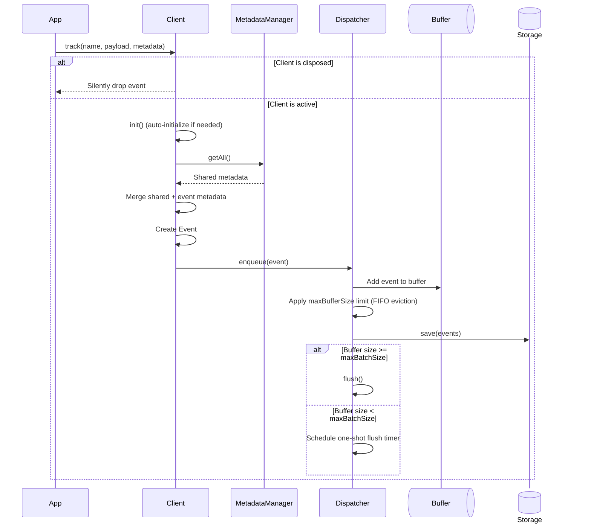
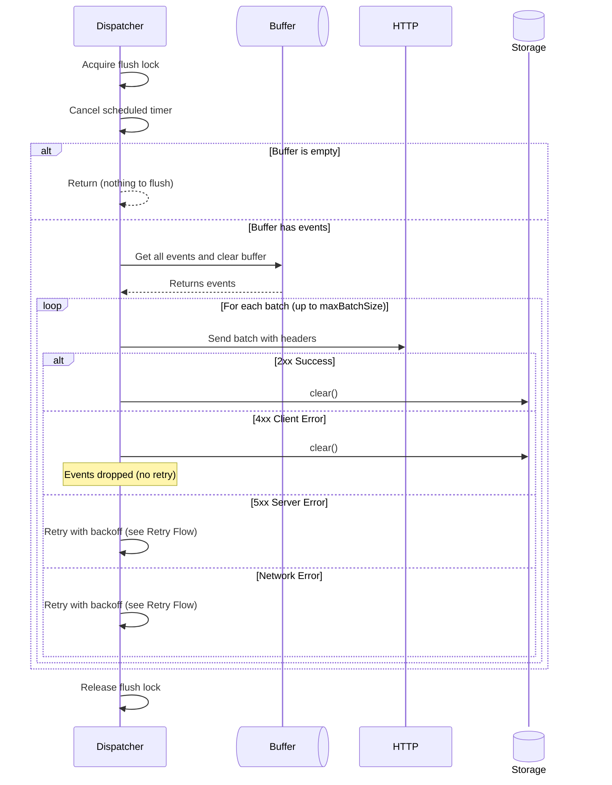
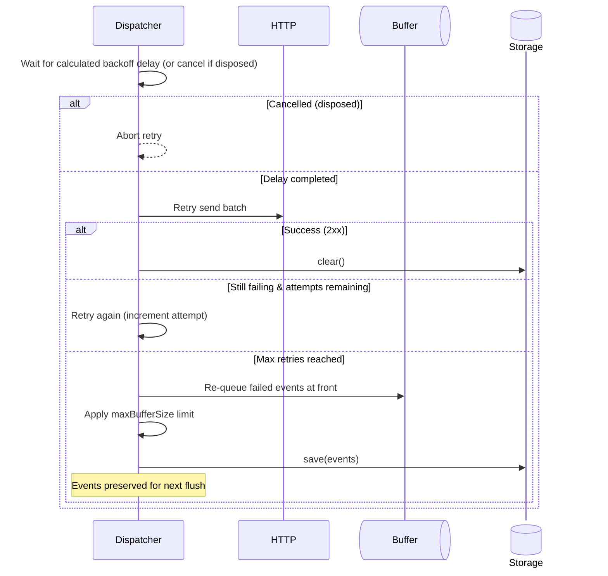
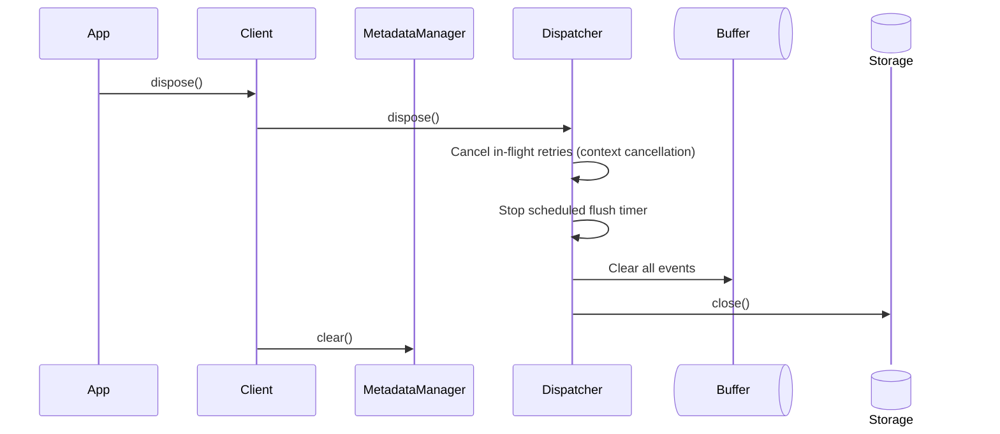
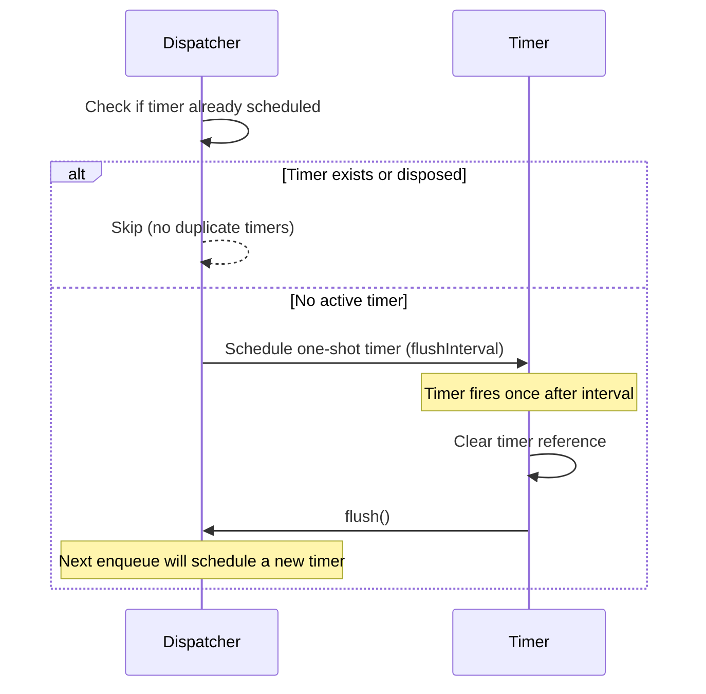
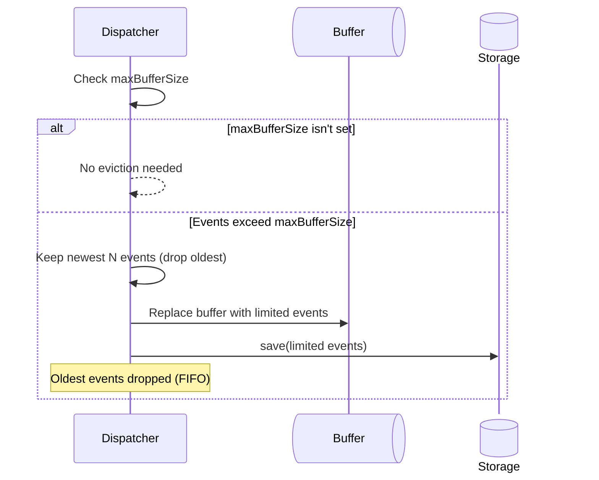
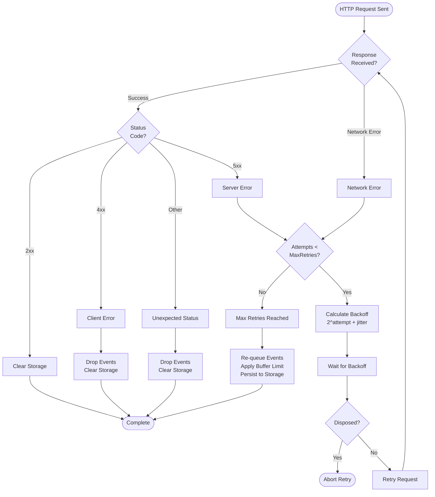
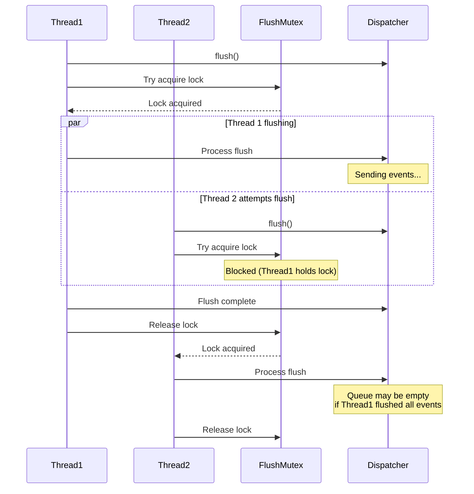

# Ripple SDK Architectural Specification

## I. Overview and Core Principles

The Ripple SDK is a high-performance, fault-tolerant event tracking system
designed using **object-oriented principles** and **dependency injection**. The
architecture emphasizes type safety, concurrency control, and flexible
extensibility.

### A. Core Architectural Principles

| Principle                 | Rationale                                                                                                                                                        |
| :------------------------ | :--------------------------------------------------------------------------------------------------------------------------------------------------------------- |
| **Consistency**           | Uniform core functionality and behavioral contracts across all language implementations.                                                                         |
| **Runtime Separation**    | Independent implementations for different environments (browser, Node.js, mobile) sharing a common core logic to optimize binary size and API compatibility.     |
| **Type Safety**           | Maximize compile-time error detection and developer experience using language-specific typing (generics, type hints, etc.).                                      |
| **Dependency Injection**  | Use **constructor injection** for adapters (e.g., HTTP, Storage) to ensure **testability** and **flexibility**. Pass interfaces/protocols, not concrete classes. |
| **Extensibility**         | Define clear interfaces for all key extension points (e.g., `HttpAdapter`, `StorageAdapter`).                                                                    |
| **Concurrency Safety**    | Protect all shared state (buffers, metadata, flush operations) using appropriate synchronization primitives (mutexes, locks).                                    |
| **Minimal Dependencies**  | Keep core dependencies restricted to the standard library to minimize bundle size and security risk.                                                             |
| **Initialization Safety** | Prevent data loss by queuing operations before `init()`. Track calls are automatically queued and processed after initialization completes.                      |
| **Idiomatic APIs**        | Adhere to language-specific conventions (e.g., naming, error handling, async patterns) while maintaining behavioral consistency.                                 |

---

## II. Component Architecture

The SDK uses four primary, single-responsibility components:

| Component           | Design Pattern            | Primary Responsibilities                                                                                       |
| :------------------ | :------------------------ | :------------------------------------------------------------------------------------------------------------- |
| **Client**          | **Facade**                | Public API (`track`, `setMetadata`, `flush`, `init`, `dispose`). Coordinates MetadataManager and Dispatcher.   |
| **MetadataManager** | **Repository**            | Stores and retrieves global metadata. Provides thread-safe metadata snapshots for events.                      |
| **Dispatcher**      | **Command Queue**         | Manages event buffer, batch processing, **atomic flush operations**, and retry logic with exponential backoff. |
| **Mutex**           | **Mutual Exclusion Lock** | Serializes concurrent operations (e.g., `flush()`) to prevent race conditions.                                 |

### Adapter Interfaces

All custom functionality is abstracted via interfaces:

- **`HttpAdapter`**: Handles API communication. Sends POST request with
  `X-API-Key: {apiKey}` (or any other custom name) header. Must return an
  `HttpResponse`.
- **`StorageAdapter`**: Handles event persistence on failure or initialization.
  Methods (`save()`, `load()`, `clear()`, `close()`) must be **idempotent** and
  handle errors gracefully. **Throws `StorageQuotaExceededError`** when storage
  quota is exceeded and events are dropped (after successfully saving reduced
  data). The `close()` method is called during disposal to release resources
  (e.g., close database connections, file handles).
- **`LoggerAdapter`**: Handles SDK internal logging with configurable log levels
  (`DEBUG`, `INFO`, `WARN`, `ERROR`, `NONE`). Built-in implementations include
  `ConsoleLoggerAdapter` and `NoOpLoggerAdapter`.
- **`SessionManager`** (Runtime-Specific): Generates and persists the unique
  session ID (`{timestamp}-{random}`).

---

## III. Type Safety and Generic Constraints

### Generic Type Parameters

The SDK provides compile-time type safety through generic parameters:

| Generic     | Constraint | Description                                                                         |
| :---------- | :--------- | :---------------------------------------------------------------------------------- |
| `TEvents`   | `Record`   | **Optional:** Maps event names to their payload types for type-safe event tracking. |
| `TMetadata` | `Record`   | **Optional:** Defines the structure of metadata attached to events.                 |

#### Usage Examples

```ts
// Define event types mapping
type AppEvents = {
  "user.login": { email: string; method: "google" | "email" };
  "page.view": { url: string; title: string; duration?: number };
  "purchase.completed": { orderId: string; amount: number; currency: string };
};

// Define metadata structure
type AppMetadata = {
  userId: string;
  sessionId: string;
  schemaVersion: string;
};

// Type-safe client instantiation
const client = new RippleClient<AppEvents, AppMetadata>(config);

// Type-safe event tracking (compile-time validation)
await client.track("user.login", {
  email: "<email>",
  method: "google",
});
```

### Backward Compatibility

- **Single Generic**: `RippleClient<any, AppMetadata>` (metadata-only typing)
- **No Generics**: `RippleClient` (no compile-time type checking)
- **Both Generics**: `RippleClient<AppEvents, AppMetadata>` (full type safety)

---

## IV. Data Structures (Contracts)

### 1. `Config` (Initialization)

| Field            | Type             | Constraint/Default                                                                                                |
| :--------------- | :--------------- | :---------------------------------------------------------------------------------------------------------------- |
| `apiKey`         | `string`         | **Required:** API authentication key.                                                                             |
| `endpoint`       | `string`         | **Required:** Valid HTTPS URL.                                                                                    |
| `apiKeyHeader?`  | `string`         | **Optional:** Header name for API key **(Default: "X-API-Key")**                                                  |
| `flushInterval?` | `number`         | **Optional:** Auto-flush interval in ms. **(Default: 5000)**.                                                     |
| `maxBatchSize?`  | `number`         | **Optional:** Max events per batch. **(Default: 10)**. Triggers immediate flush when reached.                     |
| `maxBufferSize?` | `number`         | **Optional:** Max events in memory/storage. **(Default: unlimited)**. Drops oldest events (FIFO) when exceeded.   |
| `maxRetries?`    | `number`         | **Optional:** Max retry attempts. **(Default: 3)**.                                                               |
| `httpAdapter`    | `HttpAdapter`    | **Required:** Custom HTTP adapter for API requests.                                                               |
| `storageAdapter` | `StorageAdapter` | **Required:** Custom storage adapter for persistence.                                                             |
| `loggerAdapter?` | `LoggerAdapter`  | **Optional:** Custom logger adapter for SDK internal logging. **(Default: ConsoleLoggerAdapter with WARN level)** |

### 2. `Event` (API Payload)

The structure must be JSON-serializable.

| Field       | Type                 | Description                                                 |
| :---------- | :------------------- | :---------------------------------------------------------- |
| `name`      | `string`             | Event identifier.                                           |
| `payload`   | `Map` or `null`      | Event data.                                                 |
| `issuedAt`  | `number`             | Unix timestamp in milliseconds.                             |
| `sessionId` | `string` or `null`   | Session identifier (browser/native only).                   |
| `metadata`  | `Map` or `null`      | Event/environment-specific metadata (e.g., schema version). |
| `platform`  | `Platform` or `null` | Platform information (auto-detected by runtime).            |

#### Platform (Discriminated Union)

**WebPlatform** (`type: "web"`):

- `browser`: `{ name: string, version: string }`
- `device`: `{ name: string, version: string }`
- `os`: `{ name: string, version: string }`

**NativePlatform** (`type: "native"`):

- `device`: `{ name: string, version: string }`
- `os`: `{ name: string, version: string }`

**ServerPlatform** (`type: "server"`):

- No additional fields

### 3. `HttpResponse` (Adapter Output)

| Field    | Type      | Description             |
| :------- | :-------- | :---------------------- |
| `status` | `number`  | HTTP status code.       |
| `data?`  | `unknown` | Optional response body. |

---

## V. Public API Contract

| Method               | Signature                                                                | Description/Behavior                                                                                                                                                                            |
| :------------------- | :----------------------------------------------------------------------- | :---------------------------------------------------------------------------------------------------------------------------------------------------------------------------------------------- |
| **`init()`**         | `() -> void` (or `Future/Promise`)                                       | Restores persisted events (applying `maxBufferSize` limit) and starts scheduled flush. Events tracked before initialization are automatically queued and processed after `init()` completes.    |
| **`track()`**        | `(name: K, payload?: TEvents[K], metadata?: Partial<TMetadata>) -> void` | Creates an enriched `Event` and enqueues it. **Type-safe** event names and payloads. Triggers **auto-flush** if `maxBatchSize` is reached. **Operations are queued if called before `init()`**. |
| **`setMetadata()`**  | `(key: K, value: TMetadata[K]) -> void`                                  | Stores **type-safe** metadata for all subsequent events.                                                                                                                                        |
| **`getMetadata()`**  | `() -> Partial<TMetadata>`                                               | **Returns all stored metadata** as a shallow copy. Returns empty object if no metadata is set.                                                                                                  |
| **`getSessionId()`** | `() -> string \| null`                                                   | **Returns current session ID** or `null` if not set. Session ID is auto-generated in browser environments.                                                                                      |
| **`flush()`**        | `() -> void` (or `Future/Promise`)                                       | **Manually sends all queued events immediately**. **Mutex-protected**.                                                                                                                          |
| **`dispose()`**      | `() -> void`                                                             | **Cleans up resources and frees memory** (cancels timers, clears buffers, releases locks, resets state). **Supports re-initialization** after disposal.                                         |

---

## VI. Behavioral Guarantees

### A. Flush Guarantees

Flush is triggered by auto-flush, scheduled flush, or manual call.

- **Atomicity**: Only one flush operation runs at a time (mutex-protected).
- **Ordering**: Events are sent in **FIFO** order.
- **Persistence**: Failed events are re-queued and persisted to storage.

### B. Retry Logic (Exponential Backoff)

Retries are implemented with **exponential backoff and jitter**.

| Status Code / Error         | Retry Decision | Behavior After Max Retries   |
| :-------------------------- | :------------- | :--------------------------- |
| **2xx** (Success)           | **No Retry**   | Clear storage.               |
| **4xx** (Client Error)      | **No Retry**   | Drop events, clear storage.  |
| **5xx** (Server Error)      | **Retry**      | Re-queue and persist events. |
| **Network Error** (Timeout) | **Retry**      | Re-queue and persist events. |

The backoff delay calculation is:

$$\text{delay} = (\text{baseDelay} \cdot 2^{\text{attempt}}) + \text{jitter}$$

Where $\text{baseDelay}$ is $1000\text{ms}$ and $\text{jitter}$ is random
($0-1000\text{ms}$).

### C. Concurrency

- All public methods are thread-safe.
- Concurrent `flush()` calls are serialized via the Mutex.
- Re-queueing failed events maintains order:
  `[...failedEvents, ...currentBuffer]`.

### D. Initialization and Lifecycle

- **Events tracked before `init()` are automatically queued** and processed
  after initialization completes.
- **`init()` can be called multiple times** but only initializes once
  (subsequent calls are no-ops).
- Platform information is automatically detected during event creation.
- Metadata and payload are optional for all events.
- **Logger adapter** defaults to `ConsoleLoggerAdapter` with `WARN` level if not
  provided.
- **Type safety** is enforced at compile-time when using generic type
  parameters.
- **`dispose()` provides complete memory cleanup**: clears event buffers,
  cancels scheduled flushes, releases mutex locks, closes storage adapter, and
  resets all internal state.
- **Re-initialization after disposal**: After calling `dispose()`, you can call
  `init()` again to restart the client with a clean state.

---

## VII. Sequence Diagrams

### Initialization Flow



### Track Event Flow



### Flush Flow

A flush operation can be triggered:

- Automatically at defined `flushInterval` schedules
- Whenever the `maxBatchSize` is exceeded
- Manually via `client.flush()`



### Retry Flow



### Dispose Flow



### Scheduled Flush (One-Shot Timer) Flow



### Buffer Limit (FIFO Eviction) Flow



### HTTP Response Handling Decision Tree



### Concurrent Flush Handling



---

## VIII. Configuration Best Practices

### A. Buffer and Batch Size Relationship

**Critical Rule**: `maxBufferSize` should always be **greater than or equal to**
`maxBatchSize`.

**Runtime Validation**: The SDK returns an error at initialization when
`maxBufferSize < maxBatchSize` to help catch misconfigurations early.

| Configuration                                | Behavior                                                                                  | Recommendation  |
| :------------------------------------------- | :---------------------------------------------------------------------------------------- | :-------------- |
| `maxBatchSize: 10, maxBufferSize: 100`       | ✅ Events flush every 10, buffer can hold 100 during offline periods                      | **Recommended** |
| `maxBatchSize: 20, maxBufferSize: 1000`      | ✅ Large buffer for extended offline periods, efficient batching                          | **Recommended** |
| `maxBatchSize: 100, maxBufferSize: 50`       | ❌ Batch size never reached, events dropped unnecessarily, only time-based flush triggers | **Avoid**       |
| `maxBatchSize: 50, maxBufferSize: 50`        | ⚠️ Works but no room for accumulation during brief network issues                         | **Suboptimal**  |
| `maxBatchSize: 10, maxBufferSize: unlimited` | ✅ Unlimited buffer, events never dropped (may cause memory issues in extreme cases)      | **Default**     |

**Understanding the Parameters**:

- **`maxBatchSize`**: Controls **when** events are sent (triggers immediate
  flush)
  - Determines network request frequency
  - Affects latency and throughput
  - Smaller values = more frequent requests, lower latency

- **`maxBufferSize`**: Controls **how many** events are kept in memory/storage
  - Prevents unbounded memory growth
  - Drops oldest events (FIFO) when exceeded
  - Applied before saving to storage AND when restoring from storage
  - Larger values = better offline resilience

**Scenarios**:

1. **Normal Operation** (`maxBatchSize: 10, maxBufferSize: 100`):
   - Events flush every 10 events
   - Buffer rarely fills (events sent frequently)
   - Optimal for real-time tracking

2. **Offline Mode** (`maxBatchSize: 10, maxBufferSize: 100`):
   - Buffer accumulates up to 100 events
   - Oldest events dropped when limit exceeded
   - Events sent when connection restored

3. **Misconfigured** (`maxBatchSize: 100, maxBufferSize: 50`):
   - Buffer hits 50 → drops to 50 → never reaches 100
   - Batch size never triggers flush
   - Events only sent via time-based flush (`flushInterval`)
   - Data loss without warning

### B. Storage Quota Handling

Storage adapters should automatically handle quota exceeded errors:

1. **Detection**: Catch platform-specific quota errors (e.g.,
   `QuotaExceededError` in browsers, disk full errors in native/server)
2. **Graceful Degradation**: Drop oldest 50% of events and retry save
3. **Transparency**: Throw/return custom error with details about saved/dropped
   counts
4. **Logging**: Dispatcher logs warning with dropped event count

**Implementation Guidelines**:

- Set reasonable `maxBufferSize` to prevent quota issues
- Use TTL to automatically expire old events
- Monitor storage quota warnings in production
- Choose storage mechanism appropriate for expected data volume

### C. Storage Mechanism Selection Guidelines

| Characteristic       | Small Volume (<100 events)      | Medium Volume (100-1000 events) | Large Volume (>1000 events) |
| :------------------- | :------------------------------ | :------------------------------ | :-------------------------- |
| **Browser**          | LocalStorage                    | LocalStorage                    | IndexedDB                   |
| **Native (Mobile)**  | SharedPreferences, UserDefaults | SQLite, Realm                   | SQLite, Realm               |
| **Server (Node.js)** | In-Memory, File System          | File System, SQLite             | Database, File System       |

**Capacity Guidelines**:

- **LocalStorage**: ~5-10MB (browser-dependent)
- **IndexedDB**: ~50MB+ (browser-dependent, can request more)
- **Native Storage**: Device-dependent (typically 100MB+ available)
- **File System**: Disk-dependent (typically unlimited for practical purposes)

## IX. Quality and Implementation Checklist

### A. Performance

- **Time Complexity**: `enqueue()`, `dequeue()`, `setMetadata()`,
  `getMetadata()` are **O(1)**. `flush()` is **O(n)**, where $n$ is the batch
  size.
- **Space Complexity**: Buffer is **O(n)** (number of queued events).

### B. Testing and Standards

- **Testing**: Must include comprehensive **Unit**, **Integration**, and
  **Concurrency Tests**.
- **Versioning**: Follow **Semantic Versioning 2.0.0**.
- **Security**: **HTTPS only**. API keys should not be hardcoded (use
  environment variables). PII should be hashed or anonymized.

### C. Future Improvements

1. **Middleware System**: Introduce hooks for event transformation, filtering,
   and enrichment.
2. **Batch Compression**: Add optional Gzip compression for large event batches.
3. **Event Sampling**: Configurable sampling rates for high-volume scenarios.
4. **429 Rate Limit Handling**: Treat HTTP 429 (Too Many Requests) as a
   retryable error instead of a client error. Implement retry with exponential
   backoff, respect `Retry-After` header when present, and re-queue events.
5. **Byte-based Buffer Limit**: The current `maxBufferSize` is event-count
   based, but storage quotas are byte-based. A byte-size limit option would more
   accurately prevent `QuotaExceededError`.
